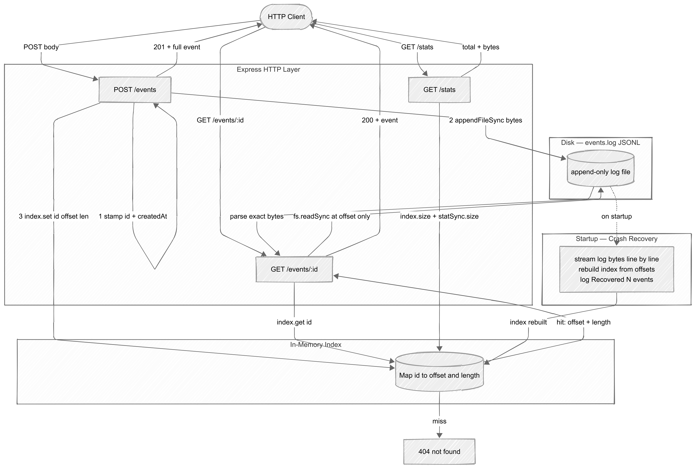

# Append-Only Event Store

A small HTTP service built at Dilamme R&D to prototype crash-safe event persistence. The log file is the database — no SQLite, no rewrites. An in-memory byte-offset index makes every read an O(1) seek.

---

## Setup

**Requirements:** Node.js 20+

```bash
npm install
npm run dev
```

The server starts on `http://localhost:3000`. Set `PORT` env var to override.

---

## curl Commands

### POST /events
Write any JSON object. The service stamps `id` (UUID v4) and `createdAt` (ISO 8601).

```bash
curl -s -X POST http://localhost:3000/events \
  -H "Content-Type: application/json" \
  -d '{"type":"order","userId":"u42","amount":149.99}' | jq
```

Response (201):
```json
{
  "type": "order",
  "userId": "u42",
  "amount": 149.99,
  "id": "a1b2c3d4-...",
  "createdAt": "2026-06-01T10:30:00.000Z"
}
```

### GET /events/:id
Fetch a single event by ID using a direct byte-range seek — no file scan.

```bash
curl -s http://localhost:3000/events/a1b2c3d4-... | jq
```

Returns 404 if the ID is not in the index:
```json
{ "error": "not found" }
```

### GET /stats
Total events written and bytes on disk.

```bash
curl -s http://localhost:3000/stats | jq
```

Response:
```json
{ "total": 3, "bytes": 412 }
```

---

## Architecture Diagram



---

## Core Concepts

### Why append-only is safer than overwriting in place

When you overwrite a file in place, there are two distinct disk operations: erase the old bytes, write the new ones. If the process dies between those two steps, you get a partially-written file that is neither the old data nor the new data — it is corrupt. This is called a torn write.

Appending never touches existing bytes. The old data is always intact. If the process dies mid-append, the file still contains every previously completed write in full. The partial new line at the end is skipped during recovery (JSON.parse fails on it, so it is ignored). This is exactly how Postgres WAL and Kafka log segments work.

### Why an index makes reads O(1) instead of O(n)

Without an index, finding event `id = "abc"` means reading the file from byte 0, parsing each line, comparing IDs until a match — an O(n) scan that gets slower as the log grows.

The in-memory `Map<id, { offset, length }>` stores the exact byte position of each event. A read becomes:
1. `map.get(id)` — O(1) hash lookup
2. `fs.readSync` at that exact byte offset, reading exactly `length` bytes — no scanning

The file can grow to millions of lines; read latency stays constant.

---

## Recovery Log Screenshot

After writing 3 events, stopping, and restarting:

```
$ npm run dev

Recovered 3 events
Event store listening on http://localhost:3000
```

---

## What I Struggled With

**Offset math during recovery.** The tricky part was making sure the `offset` stored at write time matched exactly what the recovery pass would compute. Using `readline` would strip the `\n`, so the byte count per line would be off by 1 for every event. I switched to reading the raw file buffer and iterating byte-by-byte to find `0x0a` (newline), slicing the exact bytes including the newline. This gave me a `length` identical to what `Buffer.from(line + '\n', 'utf8').length` produces at write time.

**Unicode payloads.** A payload with `"café 🎉"` is 10 characters but 14 bytes in UTF-8. Storing character counts instead of byte counts would silently corrupt seeks for any event containing non-ASCII content. The fix was to always use `Buffer.from(..., 'utf8').length` and never `str.length`.

**ESM imports.** With `"type": "module"` in `package.json`, all relative imports need the `.js` extension even though the source files are `.ts`. This is a Node ESM requirement — `tsx` handles it transparently in dev, but it is easy to forget.

---

## What I Learned

- **WAL pattern** — this project is a miniature write-ahead log. Every production database uses this exact mechanism. Understanding it from first principles made Postgres crash recovery documentation much less abstract.
- **Byte-level file I/O in Node** — `fs.readSync` with a `position` option, `Buffer.alloc`, `Buffer.from(..., 'utf8')` — I had mostly used high-level stream APIs before. Seeking to an arbitrary byte offset is a fundamentally different mental model from reading streams.
- **JSONL as a data format** — one JSON object per line is surprisingly powerful: it is human-readable, appendable, and trivially streamable. It is used in production by Kafka, Datadog, and many logging pipelines.
- **ESM module resolution** in TypeScript/Node — the difference between `"module": "CommonJS"` and `"NodeNext"` and what it means for import paths.

---

## Resources Consulted

- [Node.js `fs.readSync` docs](https://nodejs.org/api/fs.html#fsreadsynced-buffer-offset-length-position) — for the `position` option that enables seeking
- [JSONL spec](https://jsonlines.org/) — confirmed the one-object-per-line format
- [Postgres WAL documentation](https://www.postgresql.org/docs/current/wal-intro.html) — context for why append-only is the industry standard
- [Understanding Kafka's log storage](https://kafka.apache.org/documentation/#log) — same pattern at scale

---

## Why This Made Me a Better Backend Developer

Before this project, "the database handles persistence" was something I accepted without thinking about. Now I understand what that actually means at the byte level: append to a log, keep an index in memory, replay the log on crash.

Specifically:

- I can now reason about **crash safety** in any system I build. If something writes data in two steps, I ask: what happens if the process dies between those steps?
- I understand why **Kafka does not delete messages** — the offset-based consumer model is the same pattern. Consumers store their own offset; Kafka never modifies existing data.
- I will think differently about **read performance**. A file scan on a small dataset feels fine until the file grows to 10 GB. Building the index-first habit means I default to O(1) lookups rather than retrofitting them later.
- **Unicode safety** is now a reflex. Every time I measure "length" I ask: character length or byte length?

---

## Demo Video

> [Link to be added after recording]